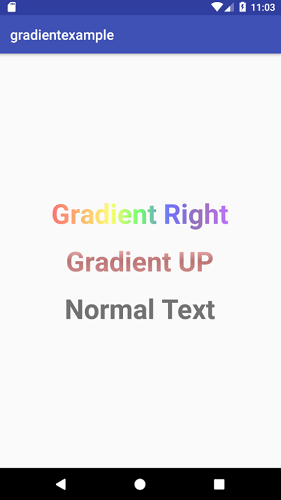

# Gradient TextView

 A Library providing the widget  `GradientTextView` which extends `AppCompatTextView` and can be used as a normal `TextView`.
 
 
 


 ### Example
 
 You can take a look at module `gradientexample` for a full example.
 
 **TL;DR:**
 
 1. Define your color resources:
 
```xml
     <color name="rainbow_red">#FF0000</color>
     <color name="rainbow_orange">#FF7F00</color>
     <color name="rainbow_yellow">#FFFF00</color>
     <color name="rainbow_green">#00FF00</color>
     <color name="rainbow_blue">#0000FF</color>
     <color name="rainbow_indigo">#4B0082</color>
     <color name="rainbow_violet">#8B00FF</color>
```
	

2. Create a file `arrays.xml` and define a color-array:

```xml
         <array name="rainbow">
             <item>@color/rainbow_red</item>
             <item>@color/rainbow_orange</item>
             <item>@color/rainbow_yellow</item>
             <item>@color/rainbow_green</item>
             <item>@color/rainbow_blue</item>
             <item>@color/rainbow_indigo</item>
             <item>@color/rainbow_violet</item>
         </array>
```


3. Use a `GradientTextView` in your layout and set the color-array along with Gradient Direction (optional):

```xml
<com.cbr.gradienttextview.GradientTextView
        android:layout_width="wrap_content"
        android:layout_height="wrap_content"
        app:gt_color_list="@array/rainbow"
        app:gt_gradient_direction="right"/>
```


### Import to Project

Project-level `build.gradle`:
```groovy
allprojects {
   repositories {
       maven { url 'https://jitpack.io' }
   }
}
```

Module-level `build.gradle`
```groovy
dependencies {
   implementation 'com.github.dimitrisCBR:GradientTextView:1.2'
}
```
